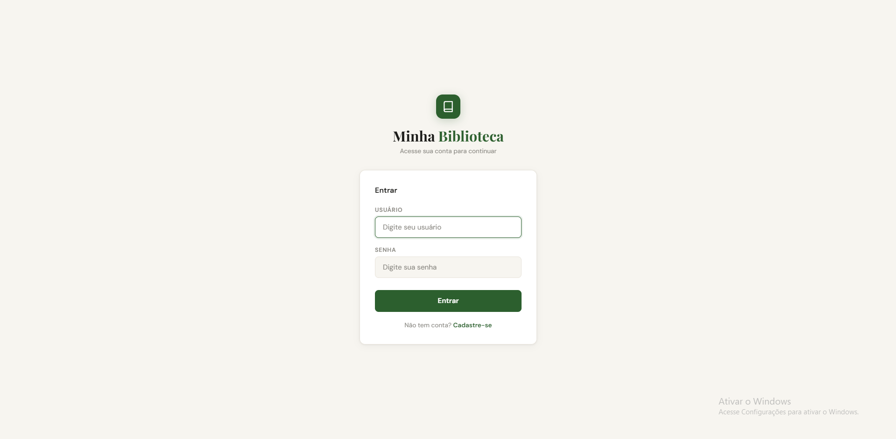
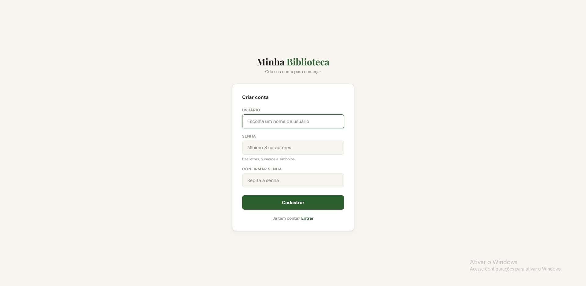
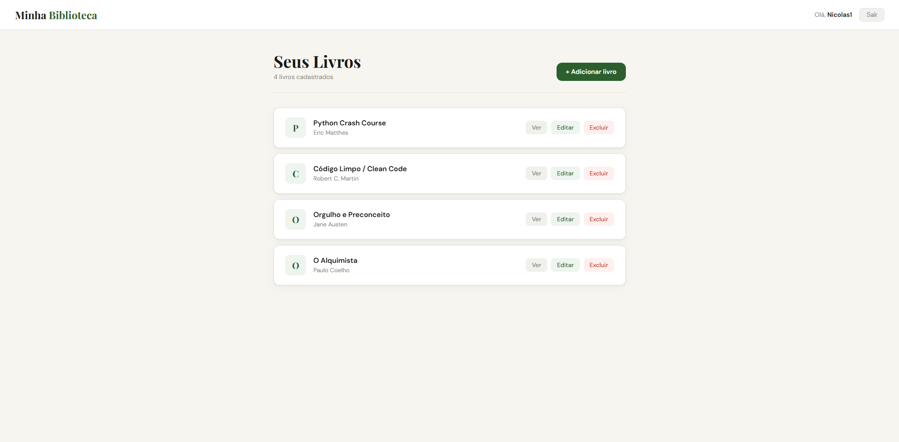
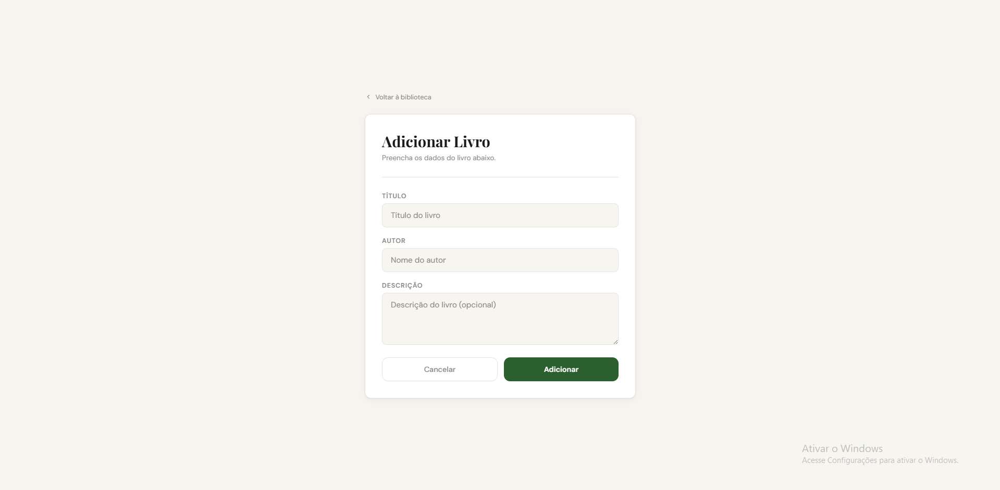
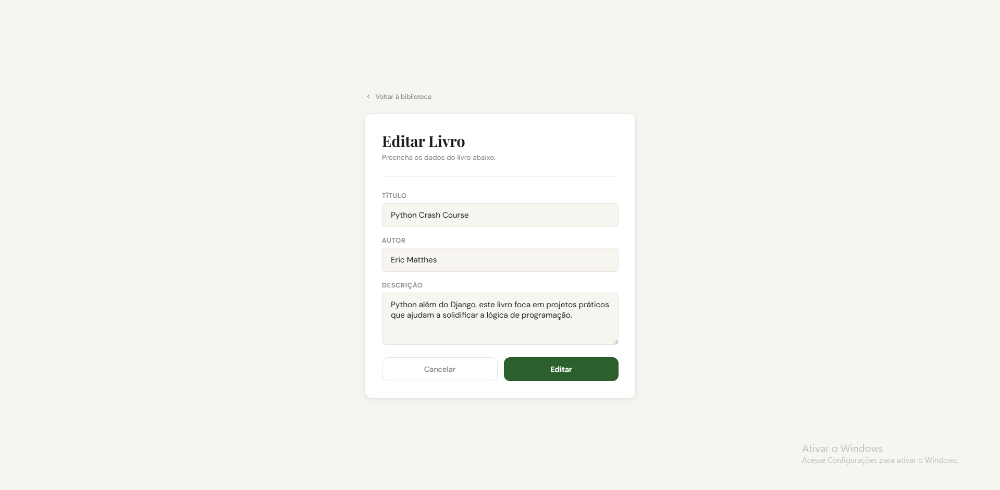
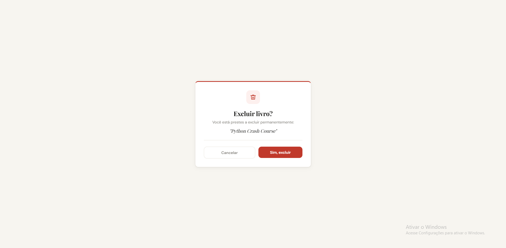
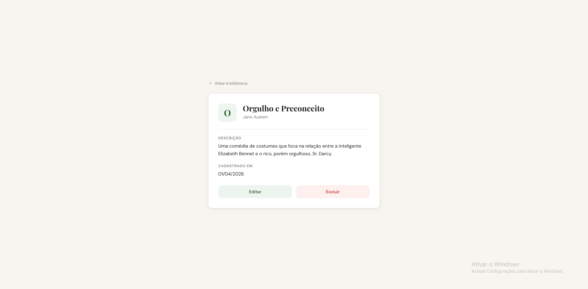

# Gerenciador de Livros / Biblioteca Pessoal (CRUD)

Aplicação web para organização de biblioteca pessoal desenvolvida com Django.
Cada usuário possui sua própria lista privada, podendo gerenciar seus livros de forma individual e segura.

## Funcionalidades

Autenticação Completa: Cadastro de novos usuários e sistema de login/logout.

Gerenciamento de Livros (CRUD): Adicionar, visualizar, editar e excluir registros de livros.

Slugs Automáticos: URLs amigáveis geradas automaticamente a partir do título do livro.

Interface Minimalista: Design focado na experiência do usuário com feedback visual.

Segurança de Dados: Restrição de acesso onde um usuário não pode visualizar ou editar livros de outros.

## Tecnologias

Backend: Python 3 + Django Framework (Function-Based Views).

Banco de Dados: PostgreSQL (via Docker).

Containerização: Docker + Docker Compose para ambiente de desenvolvimento reproduzível.

Frontend: HTML5 + CSS3 (Templates customizados).

Autenticação: Django Contrib Auth (sistema de permissões e usuários).

## Screenshots

[](screenshots/login.png)
[](screenshots/registro.png)
[](screenshots/lista-livros.png)
[](screenshots/add-livro.png)
[](screenshots/edit-livros.png)
[](screenshots/delete-livro.png)
[](screenshots/ver-livro.png)

## Como rodar localmente

### Com Docker (recomendado)

```bash
git clone https://github.com/NicolasRenck/crud-livros-django2
cd crud-livros-django2
```

Crie um arquivo `.env` na raiz com as variáveis:

```env
DB_NAME=livros_db
DB_USER=seu_usuario
DB_PASSWORD=sua_senha
DB_HOST=db
DB_PORT=5432
```

Suba os containers:

```bash
docker compose up --build
docker compose exec web python manage.py migrate
docker compose exec web python manage.py createsuperuser
```

Acesse em: `http://localhost:8000`

---

### Sem Docker

```bash
git clone https://github.com/NicolasRenck/crud-livros-django2
cd crud-livros-django2
python -m venv venv
venv\Scripts\activate  # Windows
pip install -r requirements.txt
python manage.py migrate
python manage.py runserver
```